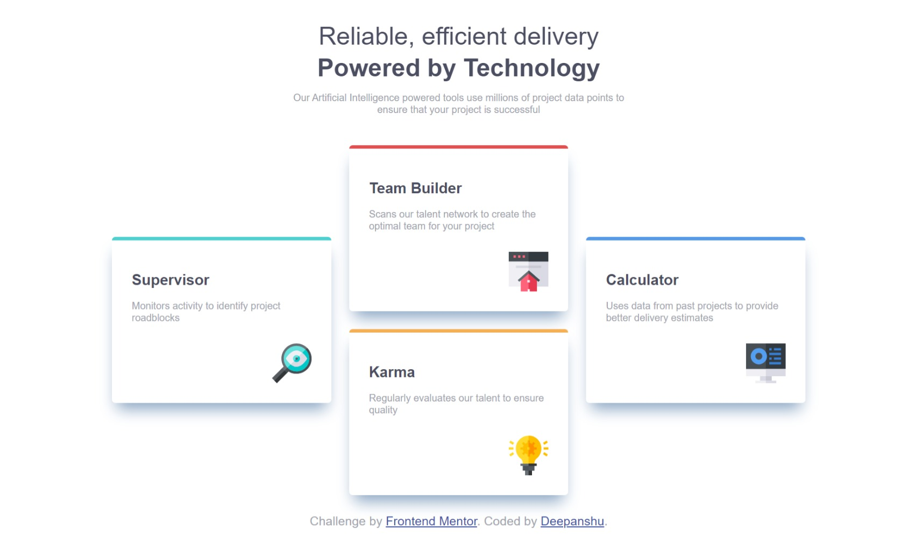
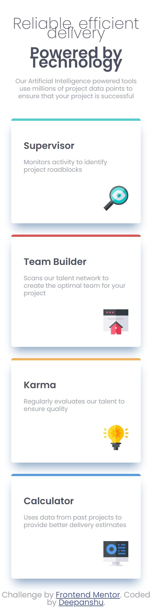

# Frontend Mentor - Four card feature section solution


This is a solution to the [Four card feature section challenge on Frontend Mentor](https://www.frontendmentor.io/challenges/four-card-feature-section-weK1eFYK). Frontend Mentor challenges help you improve your coding skills by building realistic projects. 

## Table of contents

- [Overview](#overview)
  - [The challenge](#the-challenge)
  - [Screenshot](#screenshot)
  - [Links](#links)
- [My process](#my-process)
  - [Built with](#built-with)
  - [What I learned](#what-i-learned)
  - [Continued development](#continued-development)
  - [Useful resources](#useful-resources)
- [Author](#author)
- [Acknowledgments](#acknowledgments)

## Overview

### The challenge

Users should be able to:

- View the optimal layout for the site depending on their device's screen size

### Screenshots:-
### Desktop view

### Mobile view


### Links

- Solution URL: [(https://github.com/DDeepanshu99/frontend-mentor-four-card-feature-section)]
- Live Site URL: [(https://ddeepanshu99.github.io/frontend-mentor-four-card-feature-section/)]

## My process

### Built with

- Semantic HTML5 markup
- CSS custom properties
- Flexbox
- CSS Grid

### What I learned

I learned about css custom propertiesa and css modifier classes.
I learnt about flexbox and grid and how it is used to make layouts.

```html
<div class="wrapper wrapper--narrow">
```
```css
:root{
  --ff-sans: 'Poppins', sans-serif;
  
}
html{
  font-family: var(--ff-sans);
}
/*this property selects the immediate child and make the elements grow by constant dimension*/
.layout-grid > *{
    flex: 1;
}
```

### Continued development

I am a begineer and i am still currently learning css. I did this project to learn how layouts are to be designed. I still struggle with grid layouts and media queries. I will be continuing learning more about grid and media queries.

### Useful resources

I am following kevin powell's explanation and walkthrough. I was getting stuck in between the video so i was also following mdn docs side by side.
- [(https://www.youtube.com/watch?v=JFbxl_VmIx0)] - I followed this video as a guide on how to make layouts. I just learnt about HTML and CSS so making layouts on the spot is challenging for me. This helped me on brain storminig and planning stuff
- [(https://developer.mozilla.org/en-US/)] - This is an amazing resource for learning html and css and whenever i was getting stuck i went here to learn and clear my doubts.

## Author

- GitHub - [(https://github.com/DDeepanshu99)]
- Frontend Mentor - [(https://www.frontendmentor.io/profile/DDeepanshu99)]

## Acknowledgments

I would like to give credit to Kevin Powell. He is an amazing css mentor and his tutorials helped me a lot.


